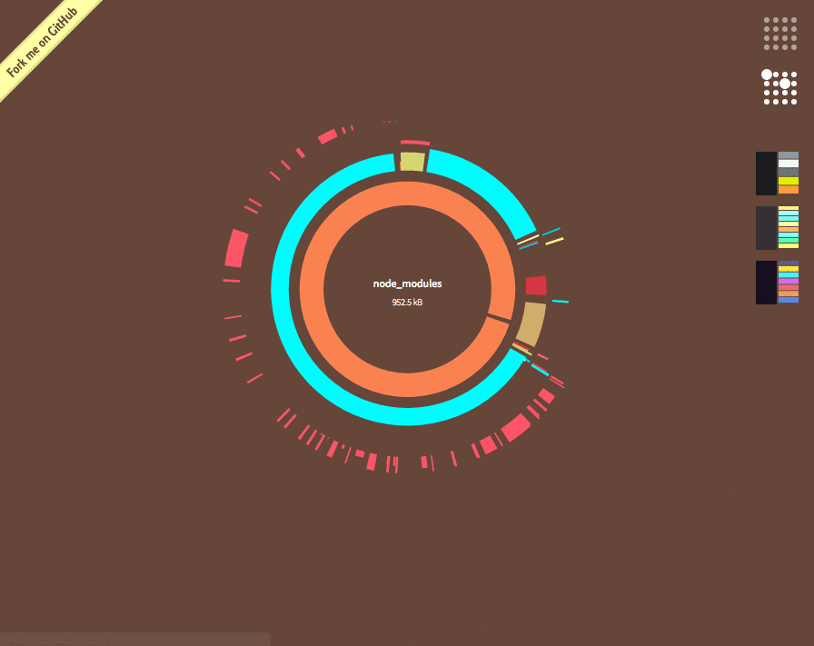

# electrify [![NPM version][npm-image]][npm-url] [![Build Status][travis-image]][travis-url] [![Dependency Status][daviddm-image]][daviddm-url]

## What is Electrify? ##

Electrify is an webpack visualizer tool for visualizing and analyzing Webpack bundles, it is a UI tool based on D3.js for visualizing the module tree of
[electrode + webpack](https://github.com/webpack/docs/wiki/node.js-api#stats) project bundles. It's especially handy
for catching large and/or duplicate modules which might be either bloating up your bundle or slowing down the build process.

Checkout a live working [DEMO](http://bit.ly/electrode_electrify).



## Installation ##

Electrify lives on [npm](https://www.npmjs.com/package/electrode-electrify), so if you haven't installed npm already
make sure you have [node](http://nodejs.org/) installed on your machine first.

Installing should then be as easy as:

``` bash
sudo npm install -g electrode-electrify
```

## Command-Line Interface ##

``` bash
electrify [stats-bundle(s)...] {options}

Options:
  -h, --help    Displays these instructions.
  -O, --open    Opens viewer in a new browser window automatically
  -m, --mode    the default file scale mode to display: should be
                either "count" or "size". Default: size
```

When you install electrify globally, `electrify` command-line tool is made
available as the quickest means of checking out your bundle. As of `electrode-electrify@v1.0.0`,
the tool takes any [webpack-stats](https://github.com/webpack/docs/wiki/node.js-api#stats) object [example](https://github.com/webpack/analyse/blob/master/app/pages/upload/example.json) as input and spits out a
standalone HTML page as output.

You can easily chain the stats file into another command, or use the `--open`
flag to open electrify in your browser automatically:


For example:

``` bash
electrify build/stats.json --open
```


## Palettes ##

You can switch between multiple color palettes, most of which serve to highlight
specific features of your bundle:

### Structure Highlights ###


Highlights `node_modules` directories as green and `lib` directories as orange.
This makes it easier to scan for "kitchen sink" modules or modules with lots of
dependencies.

### File Types ###


Highlights each file type (e.g. `.js`, `.css`, etc.) a different color. Helpful
for tracking down code generated from a transform that's bloating up your bundle
more than expected.

### Original/Pastel ###


Nothing particularly special about these palettes – colored for legibility and
aesthetics respectively.

## Search By Filename
Search by filename to get to the exact location of the file along with size that file is contributing to the Javascript bundle. Props to [@jherr](https://github.com/jherr) for implementing the Search functionality.

## License

Apache-2.0 © WalmartLabs
<br>
Built with :heart: by [Team Electrode](https://github.com/orgs/electrode-io/people) @WalmartLabs.

## Other useful bundle/stats viewers ##
- [disc-browserify](https://github.com/hughsk/disc) (Helpful for analyzing **browserify** projects and a huge inspiration for electrify, used *disc* extensively in my past **browserify** based projects)
- [webpack-bundle-size-analyzer](https://github.com/robertknight/webpack-bundle-size-analyzer)
- [webpack-visualizer](https://github.com/chrisbateman/webpack-visualizer)
- [webpack-chart](https://github.com/alexkuz/webpack-chart)
- [stats-webpack-plugin](https://github.com/unindented/stats-webpack-plugin)


[npm-image]: https://badge.fury.io/js/electrode-electrify.svg
[npm-url]: https://npmjs.org/package/electrode-electrify
[travis-image]: https://travis-ci.org/electrode-io/electrode-electrify.svg?branch=master
[travis-url]: https://travis-ci.org/electrode-io/electrode-electrify
[daviddm-image]: https://david-dm.org/electrode-io/electrode-electrify.svg?theme=shields.io
[daviddm-url]: https://david-dm.org/electrode-io/electrode-electrify
